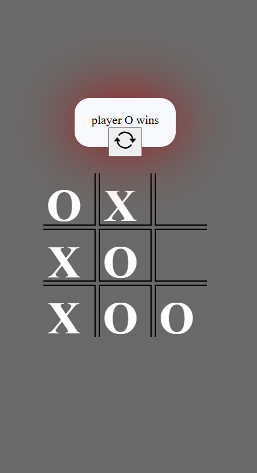

# 🎮 Tic-Tac-Toe – Classic Fun Game  

Tic-Tac-Toe is a simple yet engaging strategy game where two players take turns marking spaces in a 3×3 grid. Can you get three in a row before your opponent?  

## 🚀 Features  
✅ **Two-player mode** – Play with a friend on the same device  
✅ **AI Mode (Optional)** – Challenge an intelligent computer opponent  
✅ **Winning Highlights** – Automatically detects and highlights the winning row  
✅ **Restart Game Option** – Instantly reset and start a new round  
✅ **Responsive UI** – Works smoothly on desktop and mobile  

## 🛠 Technologies Used  
- **Frontend:** HTML, CSS, JavaScript  
- **(Optional) AI Logic:** Minimax Algorithm for an unbeatable AI  
- **(Optional) Backend:** Node.js, Express.js for online multiplayer  
📷 Screenshots   🎲 Game Board



### 1️⃣ Clone the Repository  
```sh
git clone https://github.com/KIHs0/tic-tac-toe.git
cd tic-tac-toe
